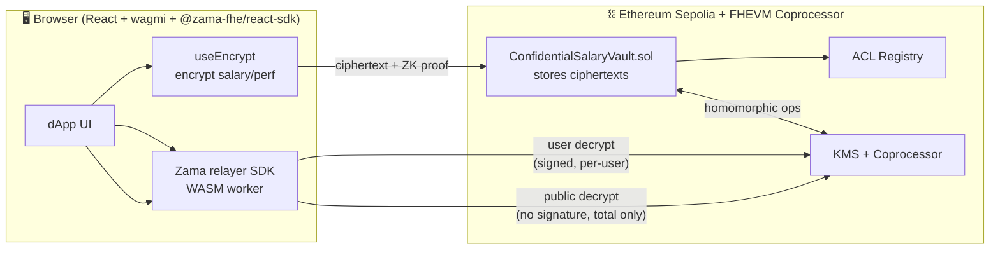

# 🔒 Confidential Salary Vault

> **Prove the payroll total on-chain — without revealing a single salary.**
> A fully-homomorphic payroll vault built on **Zama FHEVM**.

<p align="center">
  <em>Employee salaries live on-chain as <strong>encrypted ciphertext</strong>. The smart contract sums, compares and computes bonuses on them <strong>without ever decrypting</strong> a single value. An auditor reveals the grand total — every individual salary stays private.</em>
</p>

---

## 🎯 The problem

Salaries are the most sensitive number in any company. Yet today, to **prove** a payroll total to an auditor, investor, or treasury committee, you reveal everyone's pay.

**Confidential Salary Vault** flips that: the **TOTAL** can be cryptographically verified on-chain while **every individual salary remains encrypted**. Zero-knowledge audit transparency, powered by Fully Homomorphic Encryption (FHE).

## ✨ What it does

| Role | Action | Stays private? |
|------|--------|----------------|
| **HR / Owner** | Onboards employees with encrypted salary + performance | ✅ salary & performance encrypted |
| **Owner** | Reveals the **total** monthly payroll (audit mode) | ✅ only the sum decrypts; salaries stay encrypted |
| **Employee** | Decrypts **only their own** salary & performance | ✅ per-employee ACL denies everyone else |
| **Employee** | Claims payday → `payout = salary + bonus` computed **under encryption** | ✅ only the employee learns their payout |

## 🧬 FHE features (the full Zama FHEVM API, exercised)

This contract is a deliberate showcase of the **complete FHE primitive set**:

- **`FHE.fromExternal` + ZK proof** — client-side encrypted inputs with verification
- **`FHE.add` / `FHE.sub`** — homomorphic sum of all salaries into an encrypted total payroll
- **`FHE.mul` / `FHE.div`** — performance-weighted bonus: `bonus = salary × performance ÷ 100`, computed entirely on ciphertext
- **`FHE.lt` + `FHE.select`** — encrypted overflow guard (built from a homomorphic comparison + conditional select)
- **`FHE.makePubliclyDecryptable`** — the audit primitive: make **only the total** publicly decryptable
- **Per-employee ACL (`FHE.allow`)** — an employee can decrypt only their own handles; everyone else is denied on-chain
- **`FHE.allowThis`** — the cross-transaction ACL plumbing that makes homomorphic accumulation across onboarding/revision work

## 🏗️ Architecture



**Data flow:**
1. HR encrypts salary + performance **client-side** → submits ciphertext + proof to the vault.
2. The vault verifies the proof, converts with `fromExternal`, and folds the salary into an encrypted running total — **never seeing plaintext**.
3. To claim payday, the contract computes `salary + (salary × performance ÷ 100)` homomorphically, stores the encrypted payout, and ACL-grants it to the employee.
4. The employee decrypts **only their own** handles (signed, per-user decryption). HR can make the **total** publicly decryptable for an audit — individual salaries never decrypt.

## 🛠️ Tech stack

- **Solidity `0.8.28`** + [`@fhevm/solidity`](https://www.npmjs.com/package/@fhevm/solidity) — the confidential contract
- **Hardhat** + [`@fhevm/hardhat-plugin`](https://www.npmjs.com/package/@fhevm/hardhat-plugin) — compile, test (FHEVM mock), deploy
- **React 18 + Vite + TypeScript** — the dApp
- **wagmi v2 + viem** — wallet connection & contract calls
- **[`@zama-fhe/react-sdk`](https://www.npmjs.com/package/@zama-fhe/react-sdk) `3.2.0`** — encrypt, user-decrypt (with permits), public-decrypt
- **Deployed on Ethereum Sepolia testnet**

## 📁 Project structure

```
zama-salary-vault/
├── contracts/ConfidentialSalaryVault.sol   # the FHE payroll vault
├── test/ConfidentialSalaryVault.test.ts    # 9 tests, all green ✅
├── scripts/deploy.ts                        # Hardhat deploy script
├── hardhat.config.ts                        # Sepolia + FHEVM config
├── artifacts/                               # compiled ABI + bytecode (gitignored)
└── frontend/                                # the React dApp
    ├── src/
    │   ├── components/
    │   │   ├── OwnerDashboard.tsx           # onboard, reveal total, roster, cycle
    │   │   ├── EmployeeView.tsx             # decrypt own pay, claim payday
    │   │   ├── DecryptGate.tsx              # permit (ACL) flow
    │   │   ├── Roster.tsx                   # multicall roster view
    │   │   └── WalletButton.tsx             # wallet connect
    │   ├── abi.ts                           # generated contract ABI
    │   ├── zama-config.ts                   # wagmi + Zama SDK provider config
    │   └── App.tsx                          # shell, hero, tabs, error boundary
    ├── vite.config.ts                       # COOP + COEP headers (cross-origin isolation)
    └── vercel.json                          # production COOP + COEP
```

## 🚀 Quick start

### 1. Contract — compile & test

```bash
npm install
npm run compile          # compile the Solidity (FHEVM)
npm test                 # run the 9 FHEVM-mock tests
```

### 2. Deploy to Sepolia

```bash
cp .env.example .env     # set SEPOLIA_RPC_URL + a funded PRIVATE_KEY
npx hardhat run scripts/deploy.ts --network sepolia
```

Record the printed address, then point the frontend at it:

```bash
echo "VITE_VAULT_ADDRESS=0xYOUR_DEPLOYED_ADDRESS" > frontend/.env
```

### 3. Frontend — run locally

```bash
cd frontend
npm install
npm run dev              # http://localhost:5173 (COOP/COEP enabled)
```

### 4. Frontend — deploy to Vercel

The `frontend/vercel.json` already sets the required `Cross-Origin-Opener-Policy` + `Cross-Origin-Embedder-Policy` headers (needed for the FHEVM WASM worker's `SharedArrayBuffer`).

```bash
cd frontend
vercel --prod
```

## 🌐 Live deployment

| | |
|---|---|
| **Sepolia contract** | [`0xa9B609Da313d22382ba9d5dEb56cB978BDA0fe09`](https://sepolia.etherscan.io/address/0xa9B609Da313d22382ba9d5dEb56cB978BDA0fe09) |
| **Live demo    | https://salary.sabiedu.online URL coming soon_ |
| **Network** | Ethereum Sepolia (chainId `11155111`) |

## 🧪 Testing

All 9 tests pass against the FHEVM in-process mock coprocessor:

```
✓ onboards 3 employees with encrypted salaries
✓ rejects onboarding an employee twice
✓ rejects non-owner onboarding
✓ lets an employee decrypt ONLY their own salary (ACL)
✓ lets an employee decrypt their own performance
✓ reveals the TOTAL payroll publicly while salaries stay encrypted
✓ computes salary + bonus entirely under encryption
✓ blocks a second claim in the same cycle
✓ keeps one employee's payout hidden from another (ACL)
```

## 🔐 Why this matters

This maps directly to the confidential-finance use cases Zama keeps naming — **payroll, invoicing, investor distributions**. Composable privacy isn't a feature; it's the unlock for confidential on-chain finance.

---

Built for the **#ZamaDeveloperProgram** · `@zama_fhe` · BSD-3-Clause-Clear
